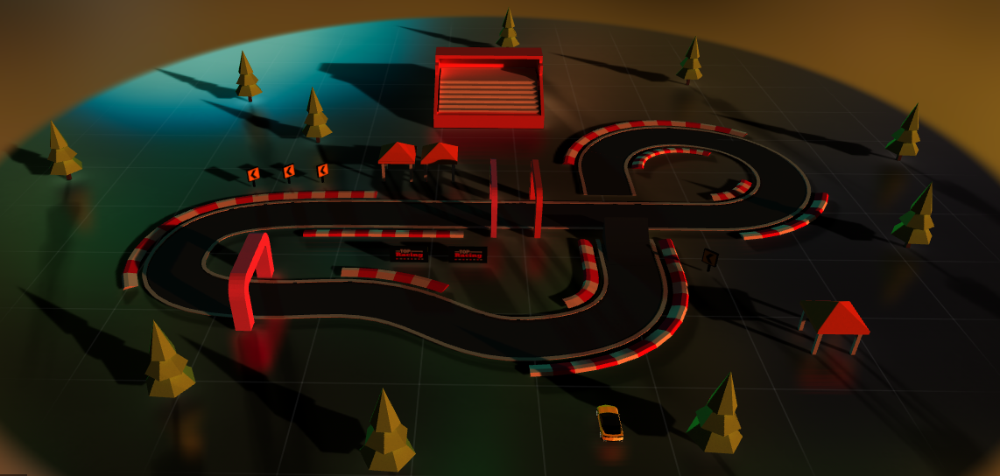

# pixel-pace

A simple car driving game implemented in three.js, Canon, and React to build a smaller demo game in React with a physics engine.

### [Demo](https://thevegeta.github.io/pixel-pace/)

### Built with

- [React](https://reactjs.org/)
- [Three.js](https://threejs.org/)
- [Typescript](https://www.typescriptlang.org/)
